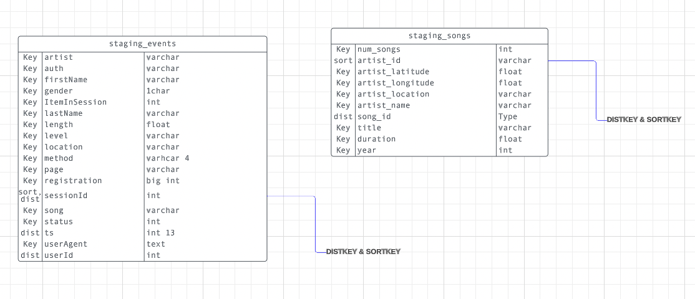
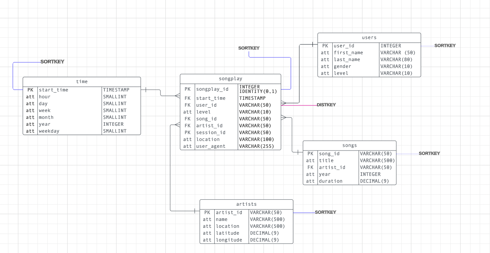

The README file includes a summary of the Sparkify AWS DWH project, how to run the Python scripts, and an explanation of the files in the repository. Comments are used effectively and each function has a docstring.

### PROJECT SUMMARY

Sparkify music data is transferred from external S3 to AWS Redshift cluster using AWS CLI and Python.

Using the song and event datasets given, a star schema optimized for queries on song play analysis has been designed and implemented.

---

### SCHEMA

Staging Tables

staging_events - includes a sample of events (log data) data filtered to A/B/C
staging_songs - includes a sample of songs (song_data) filtered to /2018/11

see the  for more information on data types and distribution / sort keys

Dimension Tables

users - users in the app
songs - songs in music database
artists - artists in music database
time - timestamps of records in songplays broken down into specific units

Fact Table

song_play -- includes all users sessions and songs played over time

## 

### DISTRIBUTION

note that smaller tables that are used frequently for queries have an ALL distribution style. Everything else is EVEN (Redshift Default)

Please refer to the schema images in this project to identify the DISTKEYS and SORTKEYS, for both staging and star schema.

---

### CONFIGURE AWS USER AND CLUSTER VIA THE AWS CONSOLE

1. create and AWS account and add the IAM and EC2 Service
2. create an S3 Bucket and add the external data source to your bucket (optional?)
3. create a IAM User with AdministratorAccess, this user does not need access to the console. They're Access Keys are used to commincate to the AWS CLI. You need to create the user BEFORE creating Access Keys.
4. create the access keys and save them somewhere safe. You will need to add them to the 'dwh.cfg' file in this project.
5. create a name for the cluster, db and set a password in the dwg.cfg file.

Basically, fill in the blanks for the dwh.cfg file

### CREATE THE PYTHON ENVIRONMENT ON YOUR MACHINE

1. Clone this repo to your local computer or download the zip files.
2. Create a virtual environment in the same folder as the scripts.

NOTE : ensure you create a gitignore file and add 'dwh.cfg' before you commit to a public git / remove your credentials

### SCRIPTS (SEE BELOW FOR MORE DETAIL ON WHAT EACH SCRIPT DOES)

ensure that sql_queries.py and dwg.cfg files are defined before running scripts.

run scripts in the following order :

1. create_cluster.py
2. create_tables.py
3. etl.py

each script has comments where necessary.

1. use boto3 to craete a AWS Redshift cluster, steps included in create_cluster.py
2. create or replace the tables in Redshift with create_tables.py
3. copy and insert data from external S3 bucket into the recently created Redshift tables etl.py
   NOTE : to avoid high charges, ensure you only load samples of the data - not all files! You can do this using prefixing

---
